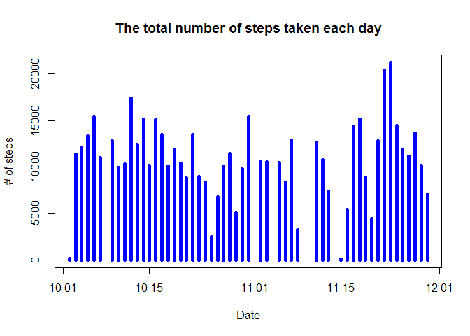
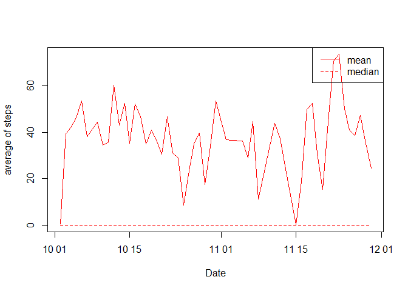
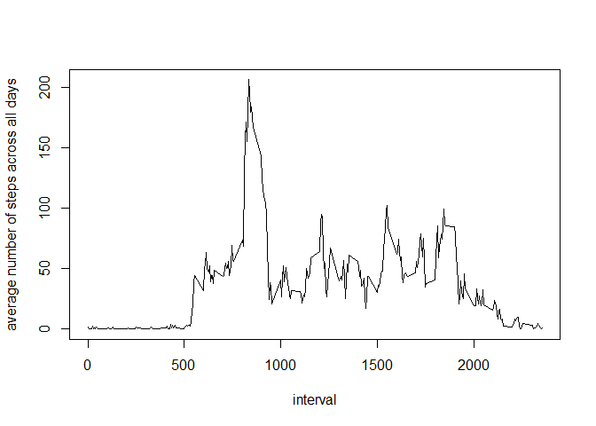
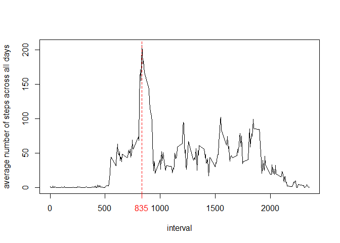
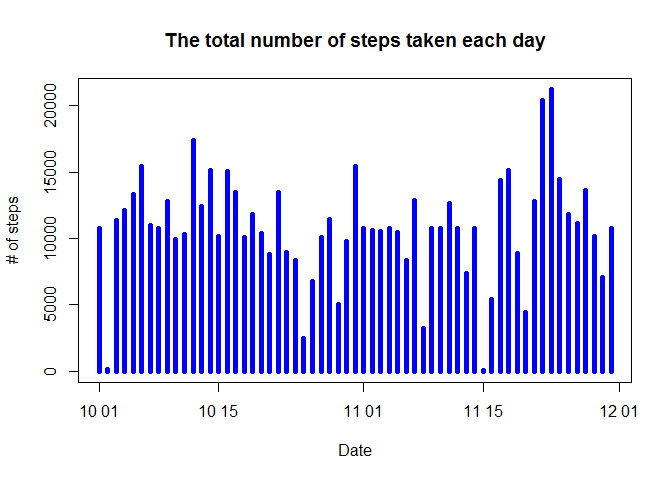
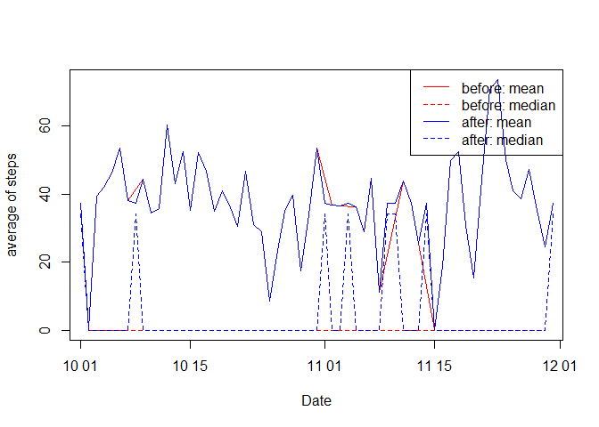

# Reproducible Research: Peer Assessment 1


## Loading and preprocessing the data
### 1. Load the data

```r
library(data.table)
df <- read.csv("activity.csv")
```

### 2. Process/transform the data into a format suitable for analysis

```r
# conversion to data.table
dt <- as.data.table(df) 
dt$date <- as.Date(dt$date, format="%Y-%m-%d")
# omit NA 
dt2 <- na.omit(dt)
```

## What is mean total number of steps taken per day?

### 1. Make a histogram of the total number of steps taken each day

```r
dt2[, sumofstepsbydate:=sum(steps), by=date]
```

```
##        steps       date interval sumofstepsbydate
##     1:     0 2012-10-02        0              126
##     2:     0 2012-10-02        5              126
##     3:     0 2012-10-02       10              126
##     4:     0 2012-10-02       15              126
##     5:     0 2012-10-02       20              126
##    ---                                           
## 15260:     0 2012-11-29     2335             7047
## 15261:     0 2012-11-29     2340             7047
## 15262:     0 2012-11-29     2345             7047
## 15263:     0 2012-11-29     2350             7047
## 15264:     0 2012-11-29     2355             7047
```

```r
plot(dt2$date, dt2$sumofstepsbydate, type="h", col="blue", lwd=5, main = "The total number of steps taken each day", xlab="Date", ylab="# of steps")
```

 

### 2. Calculate and report the mean and median total number of steps taken per day (Ignore the missing values)

```r
report <- dt2[, list(mean(steps),median(steps)), by=date]
setnames(report,2:3,c("mean","median"))
report
```

```
##           date    mean median
##  1: 2012-10-02  0.4375      0
##  2: 2012-10-03 39.4167      0
##  3: 2012-10-04 42.0694      0
##  4: 2012-10-05 46.1597      0
##  5: 2012-10-06 53.5417      0
##  6: 2012-10-07 38.2465      0
##  7: 2012-10-09 44.4826      0
##  8: 2012-10-10 34.3750      0
##  9: 2012-10-11 35.7778      0
## 10: 2012-10-12 60.3542      0
## 11: 2012-10-13 43.1458      0
## 12: 2012-10-14 52.4236      0
## 13: 2012-10-15 35.2049      0
## 14: 2012-10-16 52.3750      0
## 15: 2012-10-17 46.7083      0
## 16: 2012-10-18 34.9167      0
## 17: 2012-10-19 41.0729      0
## 18: 2012-10-20 36.0938      0
## 19: 2012-10-21 30.6285      0
## 20: 2012-10-22 46.7361      0
## 21: 2012-10-23 30.9653      0
## 22: 2012-10-24 29.0104      0
## 23: 2012-10-25  8.6528      0
## 24: 2012-10-26 23.5347      0
## 25: 2012-10-27 35.1354      0
## 26: 2012-10-28 39.7847      0
## 27: 2012-10-29 17.4236      0
## 28: 2012-10-30 34.0938      0
## 29: 2012-10-31 53.5208      0
## 30: 2012-11-02 36.8056      0
## 31: 2012-11-03 36.7049      0
## 32: 2012-11-05 36.2465      0
## 33: 2012-11-06 28.9375      0
## 34: 2012-11-07 44.7326      0
## 35: 2012-11-08 11.1771      0
## 36: 2012-11-11 43.7778      0
## 37: 2012-11-12 37.3785      0
## 38: 2012-11-13 25.4722      0
## 39: 2012-11-15  0.1424      0
## 40: 2012-11-16 18.8924      0
## 41: 2012-11-17 49.7882      0
## 42: 2012-11-18 52.4653      0
## 43: 2012-11-19 30.6979      0
## 44: 2012-11-20 15.5278      0
## 45: 2012-11-21 44.3993      0
## 46: 2012-11-22 70.9271      0
## 47: 2012-11-23 73.5903      0
## 48: 2012-11-24 50.2708      0
## 49: 2012-11-25 41.0903      0
## 50: 2012-11-26 38.7569      0
## 51: 2012-11-27 47.3819      0
## 52: 2012-11-28 35.3576      0
## 53: 2012-11-29 24.4688      0
##           date    mean median
```

```r
plot(dt2$date, dt2$sumofstepsbydate, type="h", col="blue", lwd=5, main = "The total number of steps taken each day", xlab="Date", ylab="# of steps")
```

 

```r
plot(report$date,report$mean,col="red",type="l", xlab="Date",ylab="average of steps")
points(report$date,report$median,col="red",type="l", lty=2)
legend("topright",
       c(names(report)[2],names(report)[3]),
       lty=c(1,2),
       col=c("red","red") )
```

 

## What is the average daily activity pattern?

### 1. Make a time series plot (i.e. type = "l") of the 5-minute interval (x-axis) and the average number of steps taken, averaged across all days (y-axis)

```r
activitypattern <- dt2[,mean(steps), by=interval]
setnames(activitypattern,2,"mean")
head(activitypattern)
```

```
##    interval    mean
## 1:        0 1.71698
## 2:        5 0.33962
## 3:       10 0.13208
## 4:       15 0.15094
## 5:       20 0.07547
## 6:       25 2.09434
```

```r
plot( x=activitypattern$interval, y=activitypattern$mean, type="l", xlab="interval", ylab="average number of steps across all days")
```

 

### 2. Identifier of 5-minute interval, on average across all the days in the dataset, containing the maximum number of steps

```r
(aa <- activitypattern$interval[which.max(activitypattern$mean)])
```

```
## [1] 835
```

```r
plot( x=activitypattern$interval, y=activitypattern$mean, type="l", xlab="interval", ylab="average number of steps across all days")
axis(1,at=aa, col.ticks="red", col.axis="red")
abline(v=aa, col=2, lty=2)
```

 

### >> So, Answer is 835. 

## Imputing missing values

### 1. The total number of missing values in the dataset (i.e. the total number of rows with NAs)

```r
bad <- !complete.cases(dt)
(a <- sum(bad))
```

```
## [1] 2304
```

### >> So, the total number of rows with NAs in the dataset is 2304.

### 2. Devise a filling strategy 

### >> Use the mean for that 5-minute interval across all the days

### 3. Create a new dataset that is equal to the original dataset but with the missing data filled in based on logic above.

```r
dt$steps[which(bad)] <- activitypattern[ match( dt$interval[which(bad)] , activitypattern$interval ),]$mean
head(dt)
```

```
##      steps       date interval
## 1: 1.71698 2012-10-01        0
## 2: 0.33962 2012-10-01        5
## 3: 0.13208 2012-10-01       10
## 4: 0.15094 2012-10-01       15
## 5: 0.07547 2012-10-01       20
## 6: 2.09434 2012-10-01       25
```

### 4. Make a histogram of the total number of steps taken each day and Calculate and report the mean and median total number of steps taken per day. 

```r
report2 <- dt[, list(sum(steps),mean(steps),median(steps)), by=date]
setnames(report2,2:4,c("sum","mean","median"))
plot(report2$date, report2$sum, type="h", col="blue", lwd=5, main = "The total number of steps taken each day", xlab="Date", ylab="# of steps")
```

 

```r
report2
```

```
##           date   sum    mean median
##  1: 2012-10-01 10766 37.3826  34.11
##  2: 2012-10-02   126  0.4375   0.00
##  3: 2012-10-03 11352 39.4167   0.00
##  4: 2012-10-04 12116 42.0694   0.00
##  5: 2012-10-05 13294 46.1597   0.00
##  6: 2012-10-06 15420 53.5417   0.00
##  7: 2012-10-07 11015 38.2465   0.00
##  8: 2012-10-08 10766 37.3826  34.11
##  9: 2012-10-09 12811 44.4826   0.00
## 10: 2012-10-10  9900 34.3750   0.00
## 11: 2012-10-11 10304 35.7778   0.00
## 12: 2012-10-12 17382 60.3542   0.00
## 13: 2012-10-13 12426 43.1458   0.00
## 14: 2012-10-14 15098 52.4236   0.00
## 15: 2012-10-15 10139 35.2049   0.00
## 16: 2012-10-16 15084 52.3750   0.00
## 17: 2012-10-17 13452 46.7083   0.00
## 18: 2012-10-18 10056 34.9167   0.00
## 19: 2012-10-19 11829 41.0729   0.00
## 20: 2012-10-20 10395 36.0938   0.00
## 21: 2012-10-21  8821 30.6285   0.00
## 22: 2012-10-22 13460 46.7361   0.00
## 23: 2012-10-23  8918 30.9653   0.00
## 24: 2012-10-24  8355 29.0104   0.00
## 25: 2012-10-25  2492  8.6528   0.00
## 26: 2012-10-26  6778 23.5347   0.00
## 27: 2012-10-27 10119 35.1354   0.00
## 28: 2012-10-28 11458 39.7847   0.00
## 29: 2012-10-29  5018 17.4236   0.00
## 30: 2012-10-30  9819 34.0938   0.00
## 31: 2012-10-31 15414 53.5208   0.00
## 32: 2012-11-01 10766 37.3826  34.11
## 33: 2012-11-02 10600 36.8056   0.00
## 34: 2012-11-03 10571 36.7049   0.00
## 35: 2012-11-04 10766 37.3826  34.11
## 36: 2012-11-05 10439 36.2465   0.00
## 37: 2012-11-06  8334 28.9375   0.00
## 38: 2012-11-07 12883 44.7326   0.00
## 39: 2012-11-08  3219 11.1771   0.00
## 40: 2012-11-09 10766 37.3826  34.11
## 41: 2012-11-10 10766 37.3826  34.11
## 42: 2012-11-11 12608 43.7778   0.00
## 43: 2012-11-12 10765 37.3785   0.00
## 44: 2012-11-13  7336 25.4722   0.00
## 45: 2012-11-14 10766 37.3826  34.11
## 46: 2012-11-15    41  0.1424   0.00
## 47: 2012-11-16  5441 18.8924   0.00
## 48: 2012-11-17 14339 49.7882   0.00
## 49: 2012-11-18 15110 52.4653   0.00
## 50: 2012-11-19  8841 30.6979   0.00
## 51: 2012-11-20  4472 15.5278   0.00
## 52: 2012-11-21 12787 44.3993   0.00
## 53: 2012-11-22 20427 70.9271   0.00
## 54: 2012-11-23 21194 73.5903   0.00
## 55: 2012-11-24 14478 50.2708   0.00
## 56: 2012-11-25 11834 41.0903   0.00
## 57: 2012-11-26 11162 38.7569   0.00
## 58: 2012-11-27 13646 47.3819   0.00
## 59: 2012-11-28 10183 35.3576   0.00
## 60: 2012-11-29  7047 24.4688   0.00
## 61: 2012-11-30 10766 37.3826  34.11
##           date   sum    mean median
```

### 4.1 Do these values differ from the estimates from the first part of the assignment? 

```r
plot(report$date,report$mean,col="red",type="l", xlab="Date",ylab="average of steps")
points(report$date,report$median,col="red",type="l", lty=2)
points(report2$date,report2$mean, col="blue", type="l")
points(report2$date,report2$median, col="blue", type="l",lty=2)
legend("topright",
       c( paste("before:",names(report)[2]),
          paste("before:",names(report)[3]),
          paste("after:",names(report2)[3]),
          paste("after:",names(report2)[4])
       ),
       lty=c(1,2,1,2),
       col=c("red","red","blue","blue") )
```

 

#### >> Yes, because of filling missing values, there happens some difference in median plot when averaging daily activity pattern that could be seen above chart.  

### 4.2 What is the impact of imputing missing data on the estimates of the total daily number of steps?

#### >> Big difference in median estimates but relatively small difference in mean when averaging "daily activity pattern"" that could be seen above chart.

## Are there differences in activity patterns between weekdays and weekends?

### 1.Create a new factor variable in the dataset with two levels - “weekday” and “weekend” indicating whether a given date is a weekday or weekend day.

```r
head(dt)
```

```
##      steps       date interval
## 1: 1.71698 2012-10-01        0
## 2: 0.33962 2012-10-01        5
## 3: 0.13208 2012-10-01       10
## 4: 0.15094 2012-10-01       15
## 5: 0.07547 2012-10-01       20
## 6: 2.09434 2012-10-01       25
```

```r
## Change locale 
lct <- Sys.getlocale("LC_TIME")
Sys.setlocale("LC_TIME","C")
```

```
## [1] "C"
```

```r
day <- character()
for ( i in 1:length(dt$date) ) { 
        if ( weekdays(dt$date[i]) %in% c("Monday","Tuesday","Wednesday","Thursday","Friday" ) ) 
               day <- c(day,"Weekday")
            else day <- c(day,"Weekend") 
}
newdt <- cbind(dt,day, stringsAsFactors=T)
head(newdt)
```

```
##      steps       date interval     day stringsAsFactors
## 1: 1.71698 2012-10-01        0 Weekday             TRUE
## 2: 0.33962 2012-10-01        5 Weekday             TRUE
## 3: 0.13208 2012-10-01       10 Weekday             TRUE
## 4: 0.15094 2012-10-01       15 Weekday             TRUE
## 5: 0.07547 2012-10-01       20 Weekday             TRUE
## 6: 2.09434 2012-10-01       25 Weekday             TRUE
```

```r
## Recover locale 
Sys.setlocale("LC_TIME",lct)
```

```
## [1] "Korean_Korea.949"
```

### 2. Make a panel plot containing a time series plot:

```r
library(lattice)
activitypattern2 <- newdt[,mean(steps), by=c("interval","day")]
setnames(activitypattern2,3,"steps")
with( activitypattern2, xyplot(steps~interval|day, layout=c(1,2), xlab="Interval", ylab="Number of steps", type="l"))
```

 
